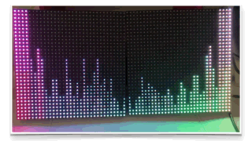

# Audio Reactive LEDs

A python program to display audio reactive animations, on a Raspberry Pi equiped with an RGB LEDs matrix.
You can find instructions to build such a setup in [this tutorial from Adafruit](https://learn.adafruit.com/adafruit-rgb-matrix-plus-real-time-clock-hat-for-raspberry-pi).

This program relies on Henner Zeller's [rpi-rgb-led-matrix](https://github.com/hzeller/rpi-rgb-led-matrix) to interact with the LEDs matrix.

## Installation
### Install the rgb-led-matrix python binding
On a Raspberry Pi equiped with an RGB LEDs Matrix, first clone the Henner Zeller's `rpi-rgb-led-matrix` reposistory : 

    git clone https://github.com/hzeller/rpi-rgb-led-matrix.git

Then follow theses instructions to install the rgb-led-matrix python binding : [rgb-led-matrix python binding install](https://github.com/hzeller/rpi-rgb-led-matrix/tree/master/bindings/python)

### Install the audio-reactive-LEDs program
Clone the current repository on your Raspberry Pi :

    git clone git@github.com:nicolas415/audio-reactive-LEDs.git

## Configuration

Modify the configuration inside `.conf/config.json` to match your setup :
* `animation_name` : the name of the animtion to display. You should create new animation class with a `name` property, and save them under `./src/animations/` (the app comes with a default spectrogram animation)
* `input_device_name`: the audio card triggering the animations. You can get a list of the available input devices by entering `arecord -l` on your Raspberry Pi terminal.
* `stream_data_chunks` the number of audio frames the signal is split into. Increasing the value increases the length of the array containing the audio signal representation
* `matrix_columns`: the number of columns of each matrix
* `matrix_rows`: the number of rows of each matrix
* `matrix_chain_length`: the number of matrix in the setup
* `matrix_brightness`: the brightness of the LEDs, goes from `0` to `100`
* `matrix_hardware_mapping`: the name of the electronic card interfacing with le LEDs matrix

## Launching the animation
At the root of your Rapberry Pi, enter the following command :

    sudo ./start.py
